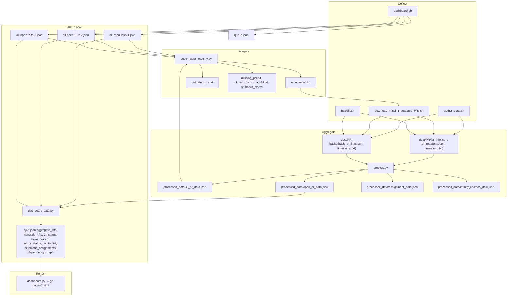

# Legacy Data Surface and Data Flow (v1)

This document explains what data the legacy `src/queueboard` pipeline uses, where it comes from, how it’s processed, and how it drives the generated dashboards. It’s intended for new contributors getting oriented before moving pieces into Django apps (`core`, `syncer`, `analyzer`, `api`).

## High-Level Flow

1) Collect inputs
- All-open PR listings (REST search) saved as `all-open-PRs-{1,2,3}.json` in the working repo and `queue.json` for GitHub’s `#queue`.
- Per‑PR GraphQL details downloaded into `data/<PR>/` (or `data/<PR>-basic/`) containing `pr_info.json`/`basic_pr_info.json` and `pr_reactions.json`.

2) Aggregate inputs into processed files
- `src/queueboard/process.py` reads `data/` and writes `processed_data/*.json`:
  - `processed_data/all_pr_data.json` (all PRs, optional)
  - `processed_data/open_pr_data.json` (open PRs)
  - `processed_data/assignment_data.json` (assignee stats)
  - `processed_data/infinity_cosmos_data.json` (auxiliary)

3) Produce “API” JSON for dashboards
- `src/queueboard/dashboard_data.py` consumes the open-PR inputs + aggregate files and emits `api/*.json` used by the HTML render step.

4) Render HTML dashboards
- `src/queueboard/dashboard.py` reads `api/*.json` and renders HTML pages using helpers and the dashboard configuration in `src/queueboard/mathlib_dashboards.py`.

The GitHub Action that orchestrates this flow (in the separate `queueboard` repo) is described in `docs/queueboard_main_workflow.md`.

## Inputs in Detail

### Open PR Listings (GraphQL search)
- Producers: `scripts/dashboard.sh` (invoked in CI in “Download .json files for all open PRs”).
- Files: `all-open-PRs-1.json`, `all-open-PRs-2.json`, `all-open-PRs-3.json` and `queue.json`.
  - `dashboard.sh` builds three GraphQL search queries to cover all open PRs (sharded by labels to avoid limits) and paginates via `gh api graphql --paginate`.
  - It also emits `queue.json` approximating GitHub’s `#queue` search.
- Parsed into `BasicPRInformation` in `src/queueboard/compute_dashboard_prs.py`:
  - number, author login, title, url, labels (name/color/url), `updatedAt`.
- Helper: `_extract_prs(data)` collects `search.nodes` into `BasicPRInformation` items.

### Per‑PR GraphQL Data
- Producers:
  - Incremental recent updates: `scripts/gather_stats.sh <minutes>` downloads PRs updated in the past N minutes (determined by REST `pulls` list), writing either full (`data/<PR>/...`) or basic (`data/<PR>-basic/...`) entries based on `stubborn_prs.txt`.
  - Targeted re‑downloads/backfill: `scripts/download_missing_outdated_PRs.sh` reads `redownload.txt`, `missing_prs.txt`, and `closed_prs_to_backfill.txt` and downloads up to a capped number per run (favoring non‑stubborn or stubborn paths accordingly).
  - Ad‑hoc backfill: `scripts/backfill.sh <PR...>` downloads specific PRs on demand.
  - All three call helpers: `scripts/pr_info.sh`, `scripts/pr_reactions.sh`, `scripts/basic_pr_info.sh`, which execute the GraphQL queries in `src/queueboard/queries/` via the GitHub CLI (`gh api graphql`).
- Directory layout and files:
  - Normal: `data/<PR>/pr_info.json`, `data/<PR>/pr_reactions.json`, `data/<PR>/timestamp.txt`.
  - Stubborn/basic: `data/<PR>-basic/basic_pr_info.json`, `data/<PR>-basic/timestamp.txt`.
- GraphQL payloads (queried by the helper scripts):
  - `pr_info.graphql` (rich): timeline events (labels added/removed, draft toggles, merges, comments, reviews), commits, files, labels, assignees, check runs/status contexts.
  - `basic_pr_info.graphql` (subset): sufficient for “basic” aggregate when PRs are stubborn/huge.
  - `pr_reactions.graphql`: reactions on comments/reviews.

Notes and limits:
- List fields are fetched with caps (e.g., `commits(first: 250)`, `reviewThreads(first: 100)`, `timelineItems(first: 250)`), which can make PRs “incomplete” for event‑based analytics.
- Some PRs are flagged “stubborn” and handled with basic data only.

Environment and tooling:
- Scripts require `gh` CLI authenticated via `GH_TOKEN` and use `jq` to pretty‑print/validate JSON.
- Repository and owner are currently hardcoded for mathlib4 in the helper scripts.

## Flow Diagram

## Aggregation and Core Types

### Aggregation Script
- Script: `src/queueboard/process.py`
- Inputs (filesystem):
  - Per‑PR full entries under `data/<PR>/`:
    - `data/<PR>/pr_info.json`
    - `data/<PR>/pr_reactions.json`
    - `data/<PR>/timestamp.txt`
  - Per‑PR basic entries under `data/<PR>-basic/`:
    - `data/<PR>-basic/basic_pr_info.json`
    - `data/<PR>-basic/timestamp.txt`
  - Control lists (read when present):
    - `stubborn_prs.txt` (used to quiet known-incomplete PRs during aggregation)
- Processing highlights:
  - Computes a coarse CI status from `statusCheckRollup.contexts` across commits via `determine_ci_status`.
  - Extracts metadata (draft, base branch, head repo/ref, state, timestamps, author/title/body, labels, files, assignees, approvals, comment counts).
  - Parses direct dependencies from the PR description (`parse_direct_dependencies`).
  - Computes optional event‑based analytics when full data is available (see next section).
- Outputs (filesystem):
  - `processed_data/open_pr_data.json` (open PRs only)
  - `processed_data/all_pr_data.json` (all PRs; omitted in fast paths)
  - `processed_data/assignment_data.json` (assignee stats)
  - `processed_data/infinity_cosmos_data.json` (auxiliary)
- Python types/functions it feeds:
  - The JSON shapes later deserialize to `AggregatePRInfo`, `LastStatusChange`, `TotalQueueTime` via `parse_aggregate_file` in `src/queueboard/compute_dashboard_prs.py`.
  - CI classification uses `CIStatus` (src/queueboard/ci_status.py).

### Event‑Based Analytics (State Evolution)
- Script: `src/queueboard/state_evolution.py` (turns timeline events into PR status transitions)
- Inputs (from `data/<PR>/pr_info.json`):
  - `pullRequest.createdAt` (creation time)
  - `pullRequest.timelineItems.nodes` including `LabeledEvent`, `UnlabeledEvent`, `ReadyForReviewEvent`, `ConvertToDraftEvent` (many event kinds are ignored as irrelevant)
  - Final `pullRequest.isDraft` and `headRepositoryOwner.login` (for `from_fork`)
- Processing:
  - `parse_data(...)` converts raw nodes into `Event` values (label add/remove, draft toggle)
  - `determine_status_changes(...)` replays events from an initial `PRState` to produce a time series of `PRStatus`
  - Derives:
    - `last_status_update(...)` → last change time, delta, and current `PRStatus`
    - `first_time_on_queue(...)` → first time the PR entered the review queue
    - `total_queue_time(...)` → total time the PR was in `AwaitingReview`
- Outputs/consumers:
  - Used by `process.py` to populate optional analytics fields in `processed_data/*`
- Python types/classes:
  - `Event`, `PRChange`, `Metadata` (named tuples)
  - `PRState`, `PRStatus` (classification), `relativedelta`/`timedelta`

### Status Classification (Labels, CI, Draft)
- Script: `src/queueboard/classify_pr_state.py`
- Inputs:
  - Label kinds derived from GitHub labels via `label_categorisation_rules` (e.g., WIP, AwaitingCI, Blocked, Delegated, Bors)
  - CI status from aggregation (`CIStatus`) and draft flag
  - Optional from_fork flag
- Processing/types:
  - `LabelKind` and `label_categorisation_rules` map concrete GitHub label names to semantic kinds (keep in sync with repo labels)
  - `PRState` combines label kinds, `CIStatus`, and draft
  - `determine_PR_status(...)` resolves a single `PRStatus` from `PRState` with precedence rules, including CI/draft handling and the “awaiting‑review by default” date change (2024‑07‑09)

## “API” Generation (JSON for the Renderer)
- Script: `src/queueboard/dashboard_data.py`
- Inputs (filesystem/argv):
  - CLI args: one or more of `all-open-PRs-*.json` produced by `scripts/dashboard.sh`.
  - `processed_data/open_pr_data.json` (aggregate source parsed into `AggregatePRInfo`).
  - `queue.json` (used in `determine_pr_dashboards` comparison with GitHub’s queue).
  - `reviewer-topics.json` (reviewer preferences used for suggestions).
  - `outdated_prs.txt` (to avoid re-suggesting PRs just flagged as outdated in the same run).
- Produces `api/*.json`:
  - `aggregate_info.json`: full mapping (PR → `AggregatePRInfo`), with placeholders for PRs missing aggregate info.
  - `draft_PRs.json`, `nondraft_PRs.json`: partition of the open set.
  - `CI_status.json`: PR → coarse CI status (for non‑draft PRs).
  - `base_branch.json`: PR → base branch.
  - `all_pr_status.json`: PR → computed `PRStatus` (labels+CI+draft classification) via `compute_pr_statusses`.
  - `prs_to_list.json`: PR partitions per dashboard via `determine_pr_dashboards`.
  - `automatic_assignments.json`: reviewer suggestions for stale unassigned PRs.
  - `dependency_graph.json`: D3‑friendly nodes/links based on `direct_dependencies` (only across open PRs present in aggregate data).
- Python types/classes involved:
  - `BasicPRInformation` and `Label` (from `src/queueboard/compute_dashboard_prs.py`) capture the open‑PR listing items.
  - `AggregatePRInfo` consolidates per‑PR aggregate metadata; constructed via `parse_aggregate_file`.
  - `PRStatus` and `CIStatus` drive `all_pr_status.json`.
  - `Dashboard` (src/queueboard/mathlib_dashboards.py) keys the `prs_to_list.json` partitions.
  - Custom serialization via `dump_to_json_file` preserves type metadata for downstream consumers.

Key data shape used across files:
- `AggregatePRInfo` (in `src/queueboard/compute_dashboard_prs.py`): consolidates per‑PR metadata and optional state‑evolution analytics:
  - draft, CI status, base branch, head repo, state, `last_updated`, author, title, description, `direct_dependencies`, labels, additions/deletions, first 100 files, approvals, assignees, commenters, comment totals (if full data), and (optional) `last_status_change`, `first_on_queue`, `total_queue_time` with validity markers.

## Rendering Dashboards (HTML)
- Script: `src/queueboard/dashboard.py`
- Inputs (filesystem/argv):
  - CLI args: output dir (`gh-pages` default) and API dir (`api` default)
  - Required API files: `aggregate_info.json`, `draft_PRs.json`, `nondraft_PRs.json`, `CI_status.json`, `base_branch.json`, `all_pr_status.json`, `prs_to_list.json`
  - Optional API files copied alongside HTML: `automatic_assignments.json`, `dependency_graph.json`
  - Static assets: `src/queueboard/static/*` (copied into output dir)
- Outputs (filesystem):
  - HTML pages in output dir: `index.html`, `on_the_queue.html`, `review_dashboard.html`, `maintainers_quick.html`, `help_out.html`, `triage.html`
- Python types/classes:
  - Deserializes API files via `load_from_json_file` (preserving `AggregatePRInfo`, `BasicPRInformation`, `PRStatus`, `CIStatus`)
  - Uses `Dashboard` enum for sections/anchors and link building; `Label` for label rendering
- Related logic:
  - `determine_pr_dashboards(...)` (in `src/queueboard/compute_dashboard_prs.py`) constructs per‑dashboard partitions; compares with `queue.json`

## Reviewer Suggestions
- Script: `src/queueboard/suggest_reviewer.py`
- Inputs (filesystem):
  - `reviewer-topics.json` (top-level areas, rotation/capacity flags, temporary breaks, conflicts of interest)
  - `processed_data/assignment_data.json` (per-user load and assigned PRs)
  - `api/aggregate_info.json` (classification, labels, status timings)
- Outputs (filesystem):
  - `api/automatic_assignments.json` (PR → suggested reviewer)
- Python types/classes:
  - `ReviewerInfo`, `AssignmentStatistics`, `ReviewerSuggestion` (NamedTuples)
  - `PRState`, `PRStatus`, `LabelKind` used for weighting decisions
  - Functions: `read_reviewer_info`, `collect_assignment_statistics`, `suggest_reviewers`, `suggest_reviewers_many`
- Heuristics:
  - Weight 1 for queue/merge-conflict; 0 for blocked/delegated/awaiting-bors/closed/contradictory/not-ready; decaying weight for awaiting-author/decision; avoids self‑assignments and declared conflicts

## Data Integrity and Backfill
- Script: `src/queueboard/check_data_integrity.py`
- Inputs (filesystem):
  - Open-PR listings: `all-open-PRs-1.json`, `all-open-PRs-2.json`, `all-open-PRs-3.json`
  - Aggregates: `processed_data/all_pr_data.json` (and `open_pr_data.json` indirectly)
  - Data directories: `data/*` for structural checks
  - Control files: `missing_prs.txt`, `closed_prs_to_backfill.txt`, `stubborn_prs.txt`, `broken_pr_data.txt`
- Outputs (filesystem):
  - `redownload.txt` (batch list) and `outdated_prs.txt` (full list)
  - Pruned/updated `missing_prs.txt`, `closed_prs_to_backfill.txt`
- Python types/classes:
  - `RESTData` (local NamedTuple), `AggregatePRInfo`, `Label`, `CIStatus`
  - Key functions: `extract_last_update_from_input`, `parse_aggregate_file`, `_check_directory`, `compare_data_inner`
- Integration:
  - `redownload.txt` is consumed by `scripts/download_missing_outdated_PRs.sh` which handles bounded re-downloads per run

## GraphQL Query Files (What We Fetch)
- Producers: `scripts/pr_info.sh`, `scripts/basic_pr_info.sh`, `scripts/pr_reactions.sh` (via `gh api graphql`)
- `src/queueboard/queries/pr_info.graphql` (full)
  - PR: identity, state, draft, base/head info, title/body/URL, timestamps.
  - Commits (+ per‑commit status rollup contexts), files (+ additions/deletions), labels, assignees.
  - Reviews, review threads and comments, issue comments.
  - Timeline events used for state evolution (labeled/unlabeled, draft/ready, merges, review request changes, etc.).
- `src/queueboard/queries/basic_pr_info.graphql` (subset)
  - Smaller set for stubborn/large PRs.
- `src/queueboard/queries/pr_reactions.graphql`
  - Reactions for comments/reviews to support future analytics/UI.

## Key Types and Enums (Where to Look)
- CI status: `src/queueboard/ci_status.py` → `CIStatus` (`pass`, `fail`, `fail-inessential`, `running`, `missing`).
- Classification: `src/queueboard/classify_pr_state.py`
  - `LabelKind`, `label_categorisation_rules` (map concrete labels → kinds), `PRState`, `PRStatus`, `determine_PR_status(...)`.
- Aggregation shapes: `src/queueboard/compute_dashboard_prs.py`
  - `BasicPRInformation`, `AggregatePRInfo`, `DataStatus`, `LastStatusChange`, `TotalQueueTime`.
- State evolution: `src/queueboard/state_evolution.py`
  - `Event`, `determine_status_changes(...)`, `first_time_on_queue(...)`, `last_status_update(...)`, `total_queue_time(...)`.
- Dashboards: `src/queueboard/mathlib_dashboards.py` → `Dashboard` enum and table descriptions/IDs.

## Known Limitations and Edge Cases
- Partial/incomplete data
  - Large PRs exceed list caps (commits, timeline items, comments), flagged as `incomplete` or handled as “basic only”.
  - “Stubborn” PRs have known broken event data and skip event‑based analytics.
- Label mapping must match current GitHub labels (`label_categorisation_rules`). Historical names may appear in timeline events (e.g., `awaiting-review` vs. `awaiting-review-DONT-USE`) and are canonicalized.
- CI aggregation compresses many contexts/runs into a coarse status (`determine_ci_status(...)`); transient “inessential” jobs are treated specially.
- Fork classification is currently disabled in status resolution (kept in comments for potential re‑enablement).

## Practical How‑Tos
- Rebuild processed data:
  - `uv run python src/queueboard/process.py`
- Regenerate dashboard API payloads from fixtures:
  - `uv run python -m queueboard.dashboard test/all-open-PRs-1.json test/all-open-PRs-2.json`
- Generate HTML from API payloads:
  - `uv run python -m queueboard.dashboard`
- Run state evolution tests:
  - `uv run python src/queueboard/test_state_evolution.py`
- Lint/format:
  - `uv run ruff check .` and `uv run ruff format .`

## Orientation Checklist (New Contributor)
- Skim `src/queueboard/compute_dashboard_prs.py` for the data shapes and dashboard partitioning logic (`AggregatePRInfo`, `determine_pr_dashboards`).
- Read `src/queueboard/classify_pr_state.py` to understand how labels/CI/draft map to PR statuses.
- Review `src/queueboard/state_evolution.py` to see how event sequences drive “time on queue” and “last change” analytics.
- Look through the query files in `src/queueboard/queries/` to see exactly what the pipeline fetches from GitHub.
- Check `src/queueboard/dashboard_data.py` to see which `api/*.json` files the renderer consumes and how missing data is handled.
- Confirm the end‑to‑end flow in `docs/queueboard_main_workflow.md` and try the local commands above.
