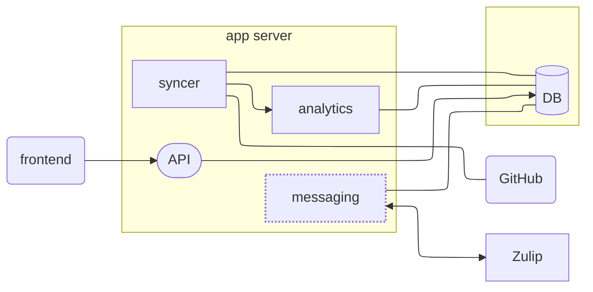

# Queueboard v2

## Architecture

### Introduction

The queueboard is outgrowing the current GitHub Actions setup and we now have some resources from the Mathlib Initiative, so I spent some time thinking about what a self-hosted version 2 might look like, inspired by the principles of the [12 factor app](https://12factor.net/).

Currently the queueboard is backed by a large directory of JSON files in the `queueboard` repo; for performance and flexibility, this data should be stored in a database of some kind.
The architecture below is based off my understanding of the current queueboard and how it might be divided into modules to work with a database.

The syncer, analytics module, and API all currently exist in some form in the current queueboard design; the messaging module is an example of a future module that could be added into this architecture.

### Diagram

## App server

### Syncer

Grab PR data from GitHub:

- scheduled queries
- listen for webhooks
- insert / update data in "raw" tables which are as close to GitHub data as possible
- get reviewer preferences

### Analytics

Compute auxiliary data from raw data:

- triggered after syncer jobs run, or on schedule
- define things like review cycles (periods between PR state changes), area-specific metrics, etc.
- update tables containing "derived" data

### API

The frontend should not be hitting the database directly, so we need a server component which returns JSON tailored to specific frontend components.
This should be a thin layer over database queries, with most of the business logic in the analytics module.

### (future work) Messaging

Send notifications to Zulip / respond to Zulip commands for updating reviewer preferences, etc.

## Frontend

Will consist of "static" HTML / JS on GitHub pages communicating with API.
This is a slight departure from the current approach of generating HTML files with Python, but will make it easier to separate presentation from data.

## Data

Some initial ideas for table schemas.

### main tables

#### pull_request

Raw PR data from GitHub, see various .graphql files.

Raw columns:
- pr number
- author
- ref
- draft
- title
- author
- ...

Raw columns which will need to be stored as raw JSON / possibly split off into separate tables like labels
- timelineItems
- commits
- comments
- reviews
- ...

Analytics Columns:
- on_the_queue
- time_on_the_queue
- ...

#### review_cycles

Example of a table for a derived quantity. Define as an interval from "being put on the queue" to being labeled `awaiting-author` or merging.
Compute from timelineItems.

Columns:
- pr
- start_time
- end_time
- timeLineItems
- ...

#### users

Columns:
- GitHub ID
- GitHub login
- review_capacity
- away_until
- Zulip username

### labels

Columns:
- GitHub ID
- name

#### areas

Subject areas in mathlib4 (manually filled in)

### many-to-many relationship tables

To keep our tables somewhat [normalized](https://en.wikipedia.org/wiki/Database_normalization), we will use some auxiliary tables to encode many-to-many relationships.
For example, a PR can have multiple labels.
If we store labels as a list in a column of the pull_request data, this will make it difficult to find all PRs with a certain label, as we will need to parse the label column for every PR.
Likewise, if we store a list of PRs in a column of the label table, it will be difficult to find all labels on a PR.
If we have a table containing pairs (PR, label), then we can easily make queries by either PR or label.

#### pr_labels

PR -> labels

#### pr_areas

PR -> areas

#### user_preferences

user -> areas

#### dependent_prs

PR -> dependent PRs
